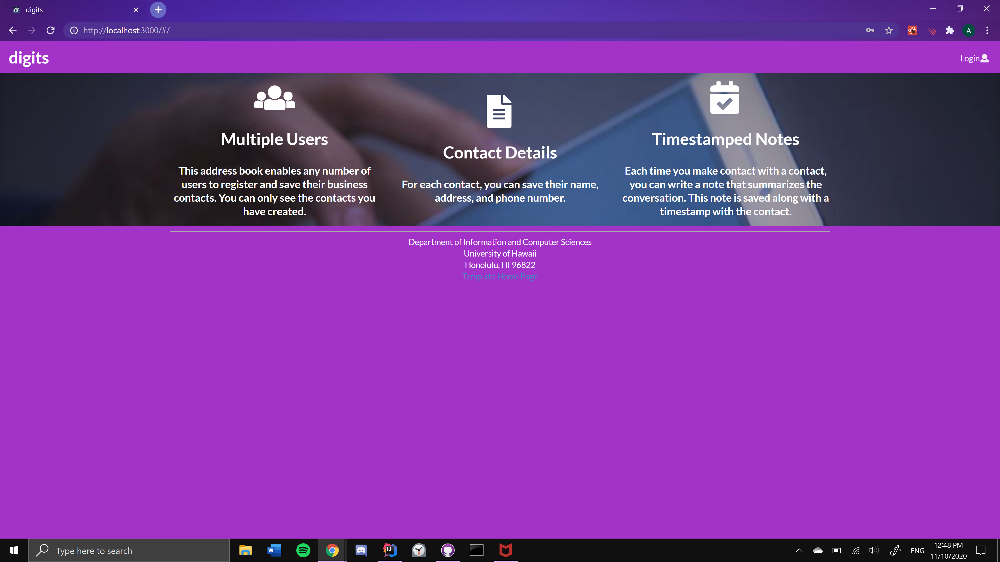
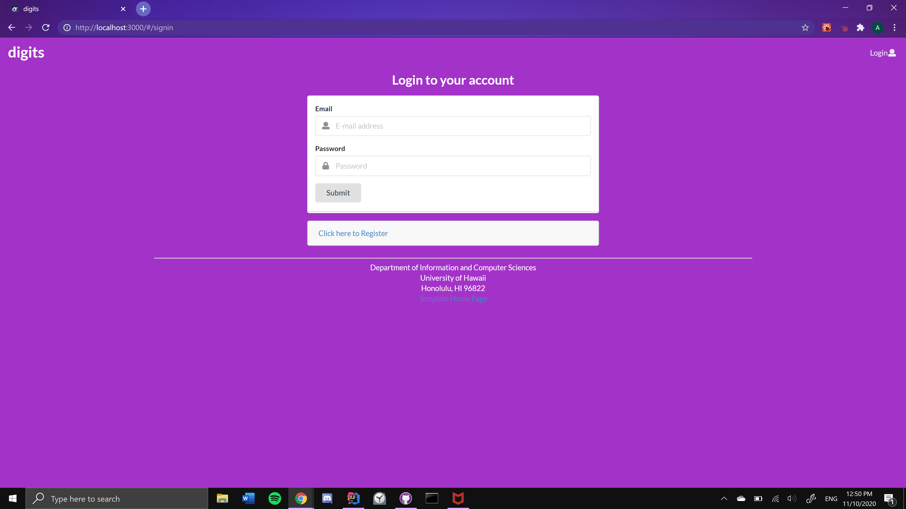
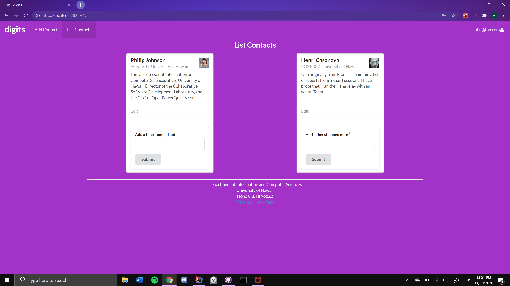
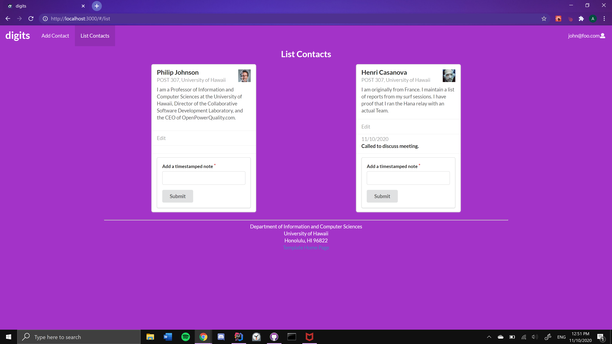
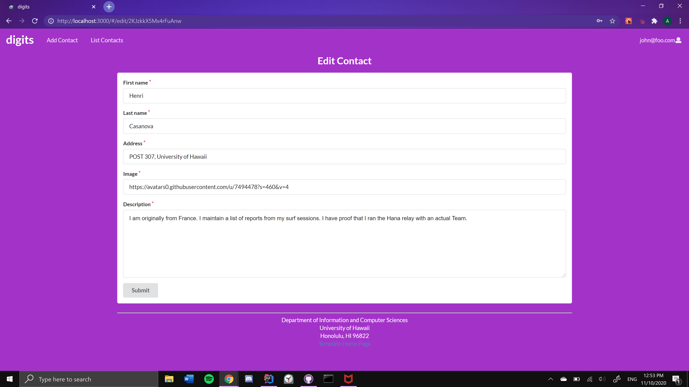
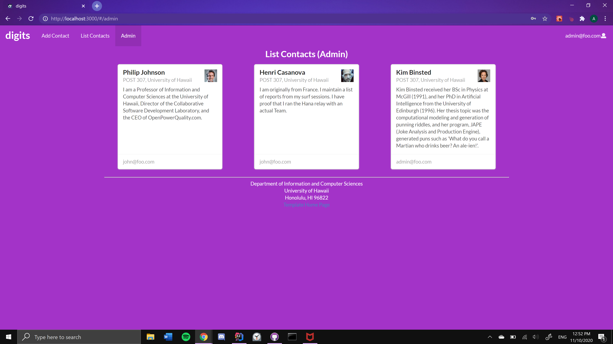

# digits



The *digits* application allows user to:
  * Create an account.
  * Create contacts.
  * Manage and edit contacts.
  * Add timestamped notes for specific contacts.

## Installation

  1. Install [Meteor](https://www.meteor.com/install).
  2. Download a copy of [*digits*](https://github.com/alison-t/digits). Permission to access the private repo must first be requested and given by the owner.
  3. "cd" into the app directory within *digits* and install necessary libraries, using the following command for Windows:

  ```
  meteor npm install
  ```

  4. Run the application with the command:

  ```
  meteor npm run start
  ```

  5. The first-time run of the application will generation two default users and some default data. The output will look like:

  ```
  C:\Users\akid6\github\alison-t\portfolio\digits\app>meteor npm run start

  > meteor-application-template-react@ start C:\Users\akid6\github\alison-t\portfolio\digits\app
  > meteor --no-release-check --exclude-archs web.browser.legacy,web.cordova --settings ../config/settings.development.json

  [[[[[ C:\Users\akid6\github\alison-t\portfolio\digits\app ]]]]]

  => Started proxy.
  => Started MongoDB.
  W20201110-12:43:41.573(-10)? (STDERR) Note: you are using a pure-JavaScript implementation of bcrypt.
  W20201110-12:43:41.626(-10)? (STDERR) While this implementation will work correctly, it is known to be
  W20201110-12:43:41.626(-10)? (STDERR) approximately three times slower than the native implementation.
  W20201110-12:43:41.627(-10)? (STDERR) In order to use the native implementation instead, run
  W20201110-12:43:41.627(-10)? (STDERR)
  W20201110-12:43:41.628(-10)? (STDERR)   meteor npm install --save bcrypt
  W20201110-12:43:41.628(-10)? (STDERR)
  W20201110-12:43:41.628(-10)? (STDERR) in the root directory of your application.
  I20201110-12:43:42.833(-10)? Creating the default user(s)
  I20201110-12:43:42.833(-10)?   Creating user admin@foo.com.
  I20201110-12:43:43.109(-10)?   Creating user john@foo.com.
  I20201110-12:46:03.440(-10)? Creating default data.
  I20201110-12:46:03.441(-10)?   Adding: Johnson (john@foo.com)
  I20201110-12:46:03.466(-10)?   Adding: Casanova (john@foo.com)
  I20201110-12:46:03.469(-10)?   Adding: Binsted (admin@foo.com)
  I20201110-12:46:03.534(-10)? Monti APM: completed instrumenting the app
  => Meteor server restarted
  => Started your app.

  => App running at: http://localhost:3000/
     Type Control-C twice to stop.
  ```

  ***Bycrypt Warning:** The following message will be displayed when running the application. It can be safely disregarded during inital development, as bycrypt is used by Meteor for password checking. Additionally, installation can be much more difficult than the message presents.

  ```
  Note: you are using a pure-JavaScript implementation of bcrypt.
  While this implementation will work correctly, it is known to be
  approximately three times slower than the native implementation.
  In order to use the native implementation instead, run

     meteor npm install --save bcrypt

  in the root directory of your application.
  ```

  6. Instructions in the output message can be followed to access the application at [http://localhost:3000/](http://localhost:3000/).
  7. Login to the application using default credentials in [settings.development.json](https://github.com/alison-t/digits/blob/master/config/settings.development.json) or sign up and create a new account.
  8. Run ESLint over the code within the applications' imports directory using:

  ```
  meteor npm run lint
  ```

## User Interface
### Landing Page
When the application is first opened, the landing page displays and provides an overview of the *digits* application's funcitons.


### Sign Up
To create a new account, click "Login" in the top-right corner and then select, "Sign Up".


### Sign In
To login using a pre-existing account, click "Login" in the top-right corner, and then select, "Sign In".



### User Home Page
Once logged in, the user home page will display. It will look similar to the landing page, except the top menu will have options to go to the "Add Contact" or "List Contacts" page. Additionally, the "Login" option will now read as the user's email.


### List Contacts
Selecting the "List Contacts" link from the top menu will bring you to a page listing all the contacts created under the user who is logged in.



Users can also add timestamped notes to contacts on this page.



### Edit Contacts
By selecting the "Edit" button on the contacts from the "List Contacts" page, users will be taken to the "Edit Contact" page where they can update and change contact information. The "submit" button can then be clicked to save and update the contact.



### Admin Mode
Using the [settings.development.json](https://github.com/alison-t/digits/blob/master/config/settings.development.json) file, one or multiple users can be given the Admin role. With this role, the home page features an additional menu item of "Admin".


By selecting the "Admin" option, Admin users will be directed to the "List Contacts (Admin)" page. There, Admin users can view contacts created by them and other users, with the user who created the contact listed at the bottom of the contact.

